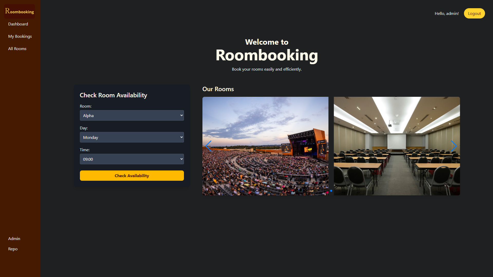
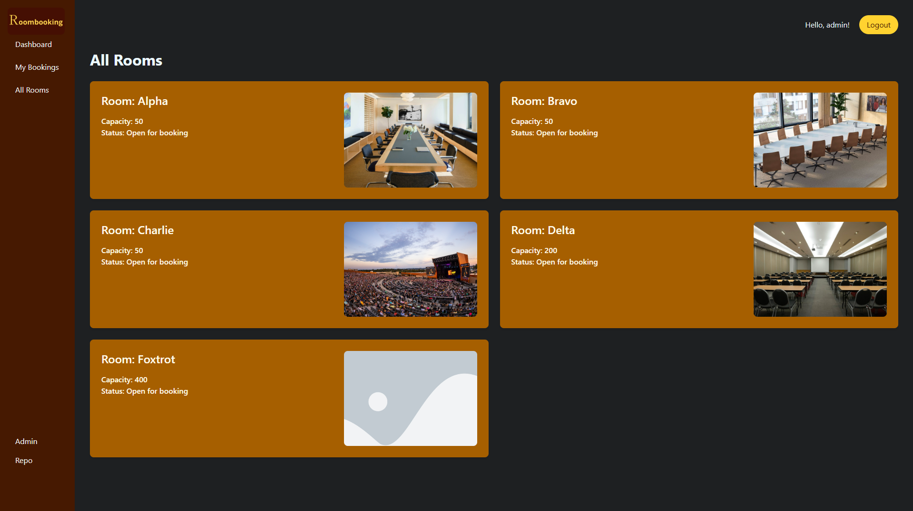

# Room Booking Django web app
This is a roombooking web app that allows students to book rooms. This project is a part of an assignment for class CN331.

---

## Features

### Student features
- Look up rooms
- Look up available time for each room
- Look up your booked room
- Cancel your booking
- Book a room

### Staff features
- Can book any number of room
- Can create, edit or remove users
- Can create, edit or remove anyone's booking
- Can create, edit or remove rooms

## How to run
1. Git clone the repository
   1. (Optional) User virtual environment with `python -m venv .venv` and `.\.venv\Scripts\activate`
2. `pip install -r requirements.txt`
3. `cd roombooking`
4. `python manage.py tailwind dev`.
   You can use runserver, but will need a separate window for running Tailwind
   1. `python manage.py runserver`
   2. `python manage.py tailwind start`

## Screetshots

